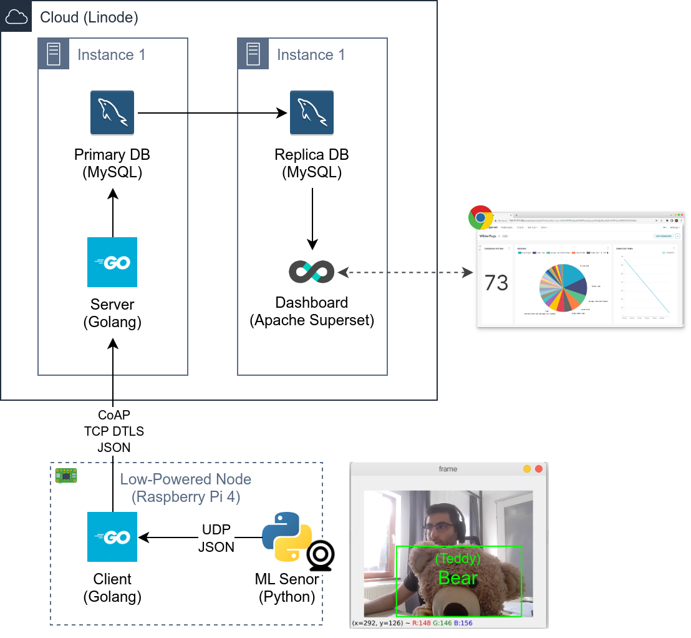

# WildFogs
[Demo Video](https://raw.githubusercontent.com/WildFogs/WildFogs/main/demo/Demonstration.mp4) 
[Documentation PDF](documentation/Prototyping%20Assignment.pdf)

## Sales Pitch
Are you a state with several national parks?
Do you want to keep track of animal statistics in your parks?
WildFogs is here to keep your wild hog population healthy and happy.
Was a bear witnessed near Camera #26?
Tell visitors to stay clear of that area!

## Architecture Overview

## Getting Started
### Client & Server
1. Make sure golang 1.18 is installed
2. Navigate into the corrseponding folder
3. run `go get`
4. run `go run .`

Alternatively use Docker (not recommended since editing config.txt is more cumbersome)
1. Navigate into the corrsponding folder
2. run `docker run -it $(docker build -q .)`

### Sensors (only tested on Linux)
1. Make sure python3 and pip are installed
2. Navigate to corresponding folder
3. run `pip install -r requirements.txt`
4. run `python main.py`

Note: Altough using Docker is possible, webcam access is tricky, we therefore do not include the Dockerfile (see older commits for Dockerfile)
https://stackoverflow.com/questions/44852484/access-webcam-using-opencv-python-in-docker

### MySQL
runs on `172.104.142.115:3306` 
replica on `178.79.139.47:3306`
